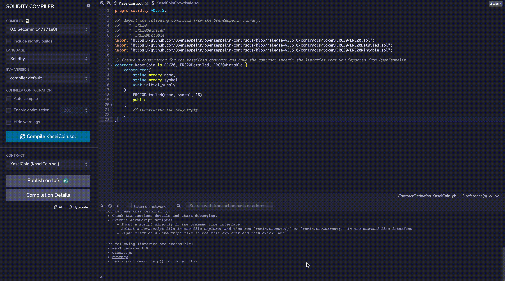
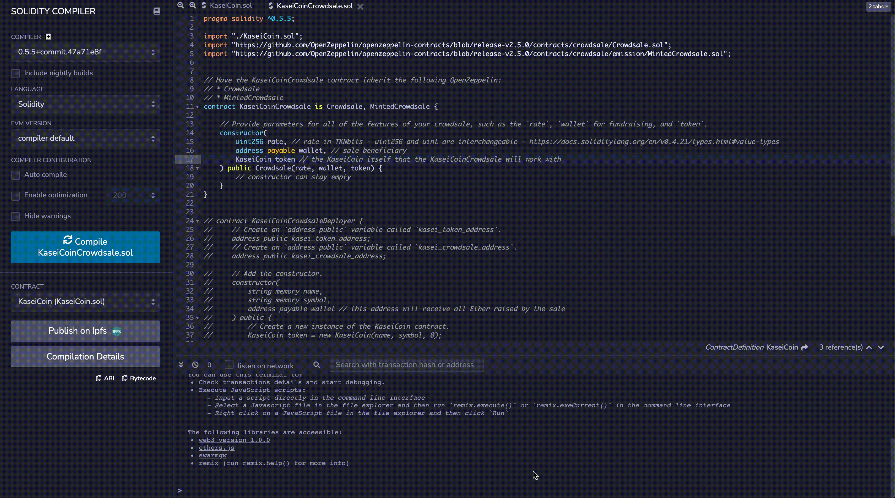
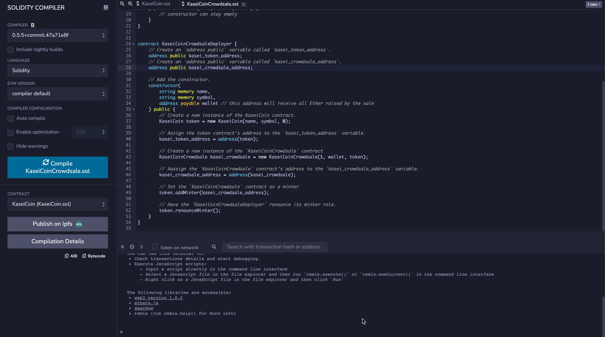

# Fungible Token Crowdsale using Solidity with RemixIDE

This project creates a fungible token that is ERC-20 compliant and that will be minted by using a Crowdsale contract from the OpenZeppelin Solidity library.

---

## Technologies

This project leverages python 3.7.9 with the following packages:

* [Solidity](https://docs.soliditylang.org/en/v0.8.9/) - To help build a smart contract.

* [Remix IDE](https://remix.ethereum.org/) - Web based IDE for building Ethereum dApps using Solidity.

* [MetaMask](https://metamask.io/) - A crypto wallet & gateway to blockchain apps.

* [Ganache](https://www.trufflesuite.com/ganache) - Quickly fire up a personal Ethereum blockchain to run tests, execute commands, and inspect state while controlling how the chain operates.

* [OpenZeppelin](https://openzeppelin.com/) - OpenZeppelin provides security products to build, automate, and operate decentralized applications.

---

## Installation Guide

Before running the application first open up the Remix IDE and:

1. Import `KaseiCoin.sol` and `KaseeiCoinCrowdsale.sol` into the IDE

2. Compile `KaseiCoin.sol` and `KaseeiCoinCrowdsale.sol`

3. Deploy `KaseiCoinCrowdsaleDeployer`

4. Link the addresses provided by `KaseiCoinCrowdsaleDeployer` to `KaseiCoin` and `KaseiCoinCrrowdsale`

---

## Evaluation Evidence

Below is an example of how the crowdsale works.

1. Compile the `KaseiCoin` Token Contract

2. Compile the `KaseiCoinCrowdsale` Contract Part 1

3. Compile the `KaseiCoinCrowdsale` Contract Part 2 with `KaseiCoinCrowdsaleDeployer`

---

## Contributors 

Nathan Patterson

Email: nathan.e.patterson@gmail.com

[LinkedIn](https://www.linkedin.com/in/natepatterson/)
[Personal Site](https://www.n8patterson.com/)

---

## License

MIT License
Copyright (c) [2021] [Nathan Patterson]

Permission is hereby granted, free of charge, to any person obtaining a copy of this software and associated documentation files (the "Software"), to deal in the Software without restriction, including without limitation the rights to use, copy, modify, merge, publish, distribute, sublicense, and/or sell copies of the Software, and to permit persons to whom the Software is furnished to do so, subject to the following conditions:

The above copyright notice and this permission notice shall be included in all copies or substantial portions of the Software.

THE SOFTWARE IS PROVIDED "AS IS", WITHOUT WARRANTY OF ANY KIND, EXPRESS OR IMPLIED, INCLUDING BUT NOT LIMITED TO THE WARRANTIES OF MERCHANTABILITY, FITNESS FOR A PARTICULAR PURPOSE AND NONINFRINGEMENT. IN NO EVENT SHALL THE AUTHORS OR COPYRIGHT HOLDERS BE LIABLE FOR ANY CLAIM, DAMAGES OR OTHER LIABILITY, WHETHER IN AN ACTION OF CONTRACT, TORT OR OTHERWISE, ARISING FROM, OUT OF OR IN CONNECTION WITH THE SOFTWARE OR THE USE OR OTHER DEALINGS IN THE SOFTWARE.
